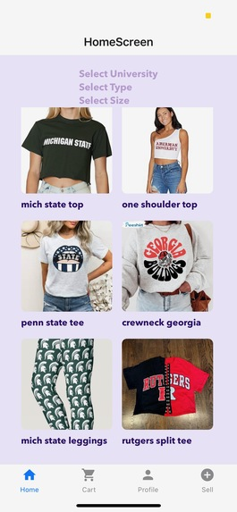
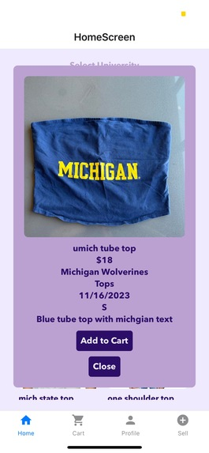
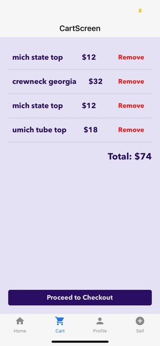
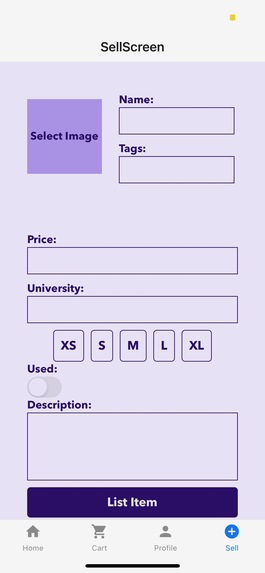

## **CampusCloset**


A student-to-student marketplace for sustainable school spirit wear!
Trade, thrift, and pass down your campus merch - our way of building community while saving money and the planet!

## **Table of Contents**

[Inspiration](#inspiration)  
[Features](#features)  
[Architecture](#architecture)  
[Installation](#installation)  
[Usage](#usage)  
[FAQ](#faq)  
[Challenges](#challenges)  
[Accomplishments](#accomplishments)  
[What We Learned](#what-we-learned)  
[Roadmap](#roadmap)  
[Contributing](#contributing)  
[Acknowledgements](#acknowledgements)

## **Inspiration**

Students love repping their school spirit at games and tailgates. But college-specific clothing is often expensive, hard to find, and unsustainable, and most times after students graduate, they don't use their tailgating merch anymore.

CampusCloset makes it easy for students to trade and thrift campus gear — strengthening community and reducing waste!

## **Features**

👕 Student Marketplace – Buy, sell, and trade campus gear

🛒 Cart System – Add, save, and check out items you love

🧑 User Profiles – Track your listings, purchases, and sales

📸 Easy Uploads – Snap, upload, and share spirit wear with others

(Add GIF here showing homepage scroll + cart functionality)

## **Architecture**

(Insert C4 diagram or system diagram here — e.g., )

Frontend: React Native (Expo)

Backend/Database: Firebase (auth, data, storage)

Hosting: Google Cloud + Local testing

Image Handling: Firebase Storage + Base64 fallback

## **Installation**

#### Clone repo

```console
$ git clone https://github.com/rachllee/mhacks.git
$ cd CampusCloset
```

#### Install dependencies

```console
$ npm install
```

##### If dependency issues

```console
$ npm install --legacy-peer-deps
```

#### Start app

```console
$ npx expo start
```

##### If network issues

```console
$ npx expo start --tunnel
```

##### If dependency issues

```console
$ npx expo start -c
```

(Add GIF here showing installation/run process in Expo)

## **Usage**

#### Browse Listings

    Filter by category, size, and style to find your next fit!




#### Add to Cart

    Save items you love and check out later!



#### Sell Spirit Wear

    Upload a photo + details and instantly list your item.



## **FAQ**

Q: Who can use CampusCloset?  
A: Any student with a valid campus login

Q: Is this secure?  
A: Yes! Authentication + data storage are handled via Firebase.

Q: Does it work cross-campus?  
A: Currently scoped to one university, but multi-campus support is on the roadmap!

## **Challenges**

Server Hosting – Struggled with local vs. cloud hosting

Image Storage – Linking images to items in Firebase was harder than expected (Base64 decoding workaround)

## **Accomplishments**

⭐ Fully functioning React Native app with Firebase integration

⭐ Polished frontend + cohesive color scheme

⭐ Unique logins per user

⭐ Item listing + cart functionality live

## **What We Learned**

Mobile development is harder than it looks (UI + API quirks)

Cloud hosting and image handling can be deceptively tricky

Good UX requires iteration, testing, and design balance

## **Roadmap (What’s Next)**

1. AI auto-tagging of uploaded images

2. Location filtering to find nearby listings

3. Attribute-based filtering (size, category, style)

4. Multi-campus expansion

## **Contributing**

Contributions welcome!

1. Fork the repo

2. Create a feature branch

3. Submit a pull request!

## **Acknowledgements**

Hackathon Members: Rachel Lee, Risha Narayanan, Netra Jayagopal, and Ashley Yan
