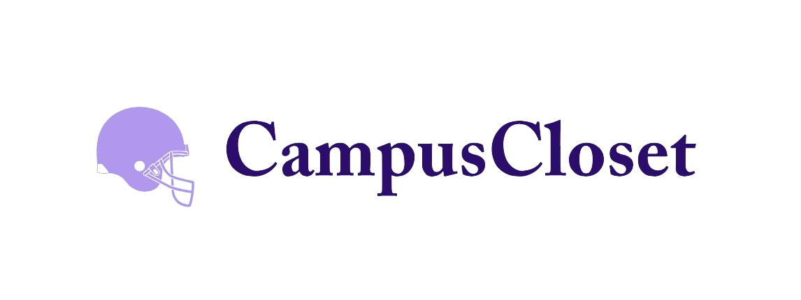
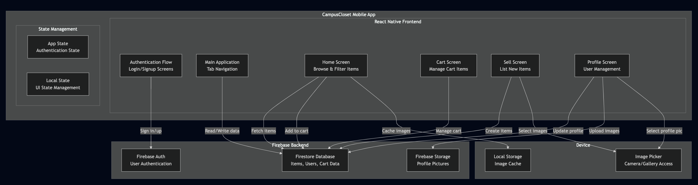
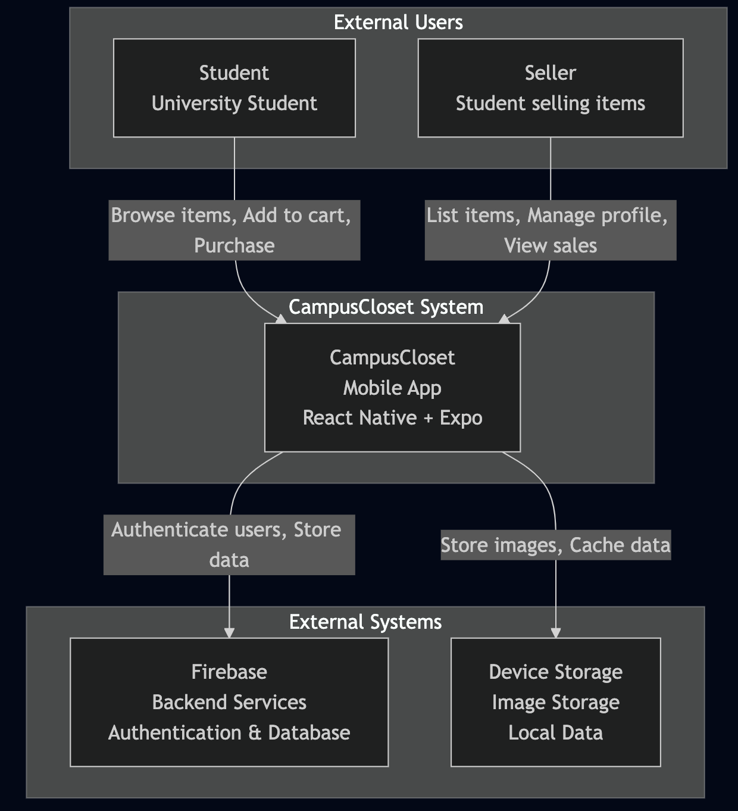

# **CampusCloset**



A student-to-student marketplace for sustainable school spirit wear.  
Trade, thrift, and pass down your campus merch — building community while saving money _and_ the planet.


## **Table of Contents**

- [Overview](#overview)
- [Inspiration](#inspiration)
- [Features](#features)
- [Architecture](#architecture)
- [Installation](#installation)
- [Usage](#usage)
- [Challenges](#challenges)
- [Accomplishments](#accomplishments)
- [What We Learned](#what-we-learned)
- [Roadmap](#roadmap)
- [Contributing](#contributing)
- [Acknowledgements](#acknowledgements)


## **Overview**

CampusCloset was created during MHacks as a way to make campus spirit wear more affordable, sustainable, and accessible. Students often buy clothing for tailgates, games, and events that they only wear a few times. By enabling easy trading and thrifting, CampusCloset reduces waste while strengthening school community.

This README provides a high-level look at how the system works, its architecture, and how to get it running—along with the design decisions and challenges behind the build.

## **Inspiration**

School spirit is a huge part of student culture, but _campus-specific clothing is expensive_. At the same time, students graduate and leave behind closets full of merch they’ll never wear again.

We wanted a seamless, mobile-first way for students to:

- Give their gear a second life
- Find affordable spirit wear
- Build a culture of reusing rather than repurchasing

CampusCloset is our answer.


## **Features**

- 👕 **Student Marketplace** – Buy, sell, and trade gear with other students
- 🛒 **Cart System** – Save your favorite items and check out when ready
- 🧑 **User Profiles** – Manage listings, purchases, and account details
- 📸 **Fast Listing Flow** – Upload photos, add details, and post instantly




## **Architecture**

A lightweight, mobile-first architecture optimized for speed during a hackathon build.



**Frontend:** React Native (Expo)  
**Backend:** Firebase Authentication + Firestore  
**Image Storage:** Firebase Storage (Base64 fallback for compatibility)


## **Installation**

### Clone repo

```console
$ git clone https://github.com/rachllee/mhacks.git
$ cd CampusCloset
```

#### Demo


### Install dependencies

```console
$ npm install
```

##### If dependency issues

```console
$ npm install --legacy-peer-deps
```

### Start app

```console
$ npx expo start
```

##### If network issues

```console
$ npx expo start --tunnel
```

##### If dependency issues

```console
$ npx expo start -c
```

Wait for the QR code to show up, and enjoy the app!!

### Installation Demo


## **Usage**

#### Browse Listings

Filter by category, size, and style to find your next fit!


#### Add to Cart

Save items you love and check out later!


#### Sell Spirit Wear

Upload a photo + details and instantly list your item.


#### User Profile

New users can sign up anytime, and will later be able to manage their profile.


## **Challenges**

Hosting & Networking: Expo tunneling + Firebase integration required careful configuration.

Image Handling: Linking device images to Firebase storage took more work than expected; Base64 decoding became a stable solution.

Hackathon Time Constraints: Balancing design, stability, and feature completeness in under 36 hours.

## **What We Learned**

Mobile development requires thoughtful UI planning and extensive testing

Image upload + storage workflows are deceptively tricky

Good UX comes from iteration, not just initial ideas

Fast prototyping during a hackathon requires tight scoping and constant decision-making

## **Roadmap (What’s Next)**

1. AI auto-tagging of uploaded images

2. Location filtering to find nearby listings

3. Attribute-based filtering (size, category, style)

4. Multi-campus expansion

## **Contributing**

Contributions welcome!

1. Fork the repo

2. Create a feature branch

3. Submit a pull request!

## **Acknowledgements**

Hackathon Members: Rachel Lee, Risha Narayanan, Netra Jayagopal, and Ashley Yan
Built at MHacks
